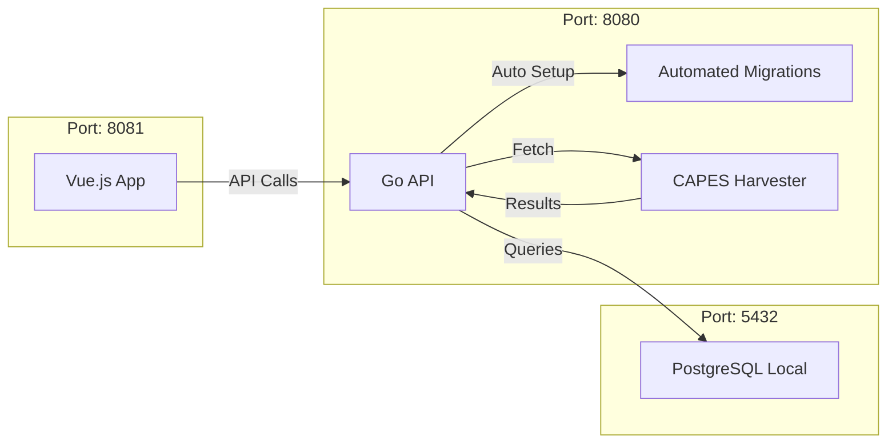

# Biblioteca Digital - Ecossistema de Comunicação

Este documento descreve como o projeto funciona agora que foi **totalmente simplificado**, com a **remoção completa do Docker** e otimizado para **execução nativa** (localhost) com máxima velocidade.

## Arquitetura Local Estabilizada



## Automação de Inicialização (Zero Config)

O projeto foi transformado em uma solução **Native-First**, eliminando a sobrecarga de containers e automatizando toda a infraestrutura:

1. **Remoção de Docker**: Todos os arquivos de configuração Docker foram removidos para simplificar o ambiente e aumentar a velocidade de desenvolvimento.
2. **Dependências**: O comando `npm run install-all` instala tudo o que é necessário para o frontend e backend.
3. **Banco de Dados**: O backend detecta automaticamente se o banco de dados `BibliotecaDigital_BD` existe no PostgreSQL local. Se não existir, ele o cria.
4. **Migrações Automáticas**: No startup, o backend cria todas as tabelas, extensões e índices necessários.

## Como Executar

Certifique-se de que o **PostgreSQL**, **Node.js** e **Go** estão instalados e rodando em sua máquina.

1. **Abra o terminal na raiz do projeto.**
2. **Execute o comando unificado:**
   ```powershell
   npm start
   ```
3. **Acesse as interfaces:**
   - **Interface do Usuário**: [http://localhost:8081](http://localhost:8081)
   - **Documentação da API (Swagger)**: [http://localhost:8080/swagger/index.html](http://localhost:8080/swagger/index.html)


## Credenciais de Acesso (Teste)

Para acessar o sistema localmente, utilize o seguinte usuário pré-cadastrado:
- **E-mail**: `gabriel@biblioteca.com`
- **Senha**: `123456`

> [!TIP]
> **Rapidez no Acesso**: Na tela de login, você pode simplesmente digitar suas credenciais e pressionar **Enter** para entrar, sem necessidade de clicar no botão.

## Integrações e APIs

### 1. APIs de Integração (Fontes Externas)
O backend utiliza um sistema de *Harvester* para consolidar dados de múltiplas fontes:
- **CAPES**: Fonte principal de materiais acadêmicos e periódicos.
- **Google Books**: Complemento de metadados, capas e descrições.
- **ArXiv & Semantic Scholar**: Busca de artigos científicos e dados de citações.

### 2. APIs Internas (Backend Endpoints)
Principais serviços disponibilizados para o Frontend:
- **Materiais**: `/materiais` (Busca, filtros, recomendações).
- **Estudo**: `/estudo` (Acesso a materiais e ferramentas de estudo).
- **Anotações**: `/anotacoes` (Gerenciamento de notas pessoais).
- **Usuários**: `/usuarios` (Autenticação e perfis).
- **Estatísticas**: `/stats` (Métricas de leitura e engajamento).

---

## Otimizações de Desenvolvimento

- **Comando Único**: Uso do `concurrently` para gerenciar frontend e backend em um único terminal.
- **Sincronização**: O backend sincroniza automaticamente com a API da CAPES a cada 30 minutos em segundo plano.
- **Busca Avançada**: Suporte nativo a Full-Text Search (FTS) em português com índices otimizados.

