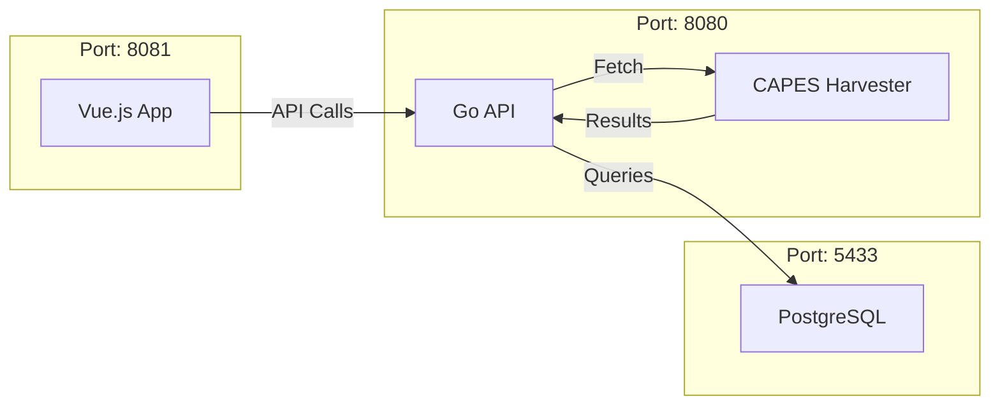

# Biblioteca Digital - Ecossistema de Comunicação

Este documento descreve como o projeto funciona agora que foi simplificado e otimizado para execução local.

## Arquitetura Simplificada



## Como Executar

O projeto foi configurado para rodar inteiramente via **Docker Compose** no `localhost`.

1. **Certifique-se de que o Docker está rodando.**
2. **Execute o comando na raiz do projeto:**
   ```powershell
   docker-compose up -d --build
   ```
3. **Acesse as interfaces:**
   - **Frontend**: [http://localhost:8081](http://localhost:8081)
   - **Backend API**: [http://localhost:8080](http://localhost:8080)
   - **Documentação Swagger**: [http://localhost:8080/swagger/index.html](http://localhost:8080/swagger/index.html)

## Otimizações Realizadas

- **Filtros Rápidos**: Adição de índices em `categoria`, `fonte` e `ano_publicacao`.
- **Busca Global**: Otimização do Full-Text Search (FTS) em Português.
- **Segurança**: Ambiente fechado para localhost, sem túneis públicos ativos.
- **Redução de Ruído**: Remoção de funcionalidades de IA e interações sociais para focar no acervo principal.

## Sincronização de Dados

O backend realiza uma sincronização automática com a **API da CAPES** a cada 30 minutos em segundo plano para manter o acervo local populado com materiais relevantes de diversas categorias (Tecnologia, Saúde, etc).
